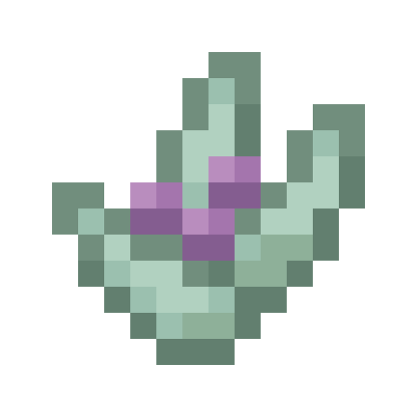

# Smudge

[>> Downloads <<](https://github.com/Boundarybreaker/Smudge/releases)

*Purify yourself!*

**This mod is open source and under a permissive license.** As such, it can be included in any modpack on any platform without prior permission. We appreciate hearing about people using our mods, but you do not need to ask to use them. See the [LICENSE file](LICENSE) for more details.

Smudge is a Minecraft od for Minecraft 1.16 and above, made for ModFest 1.16. It adds various witching equipment, like smudge sticks and crystals.
